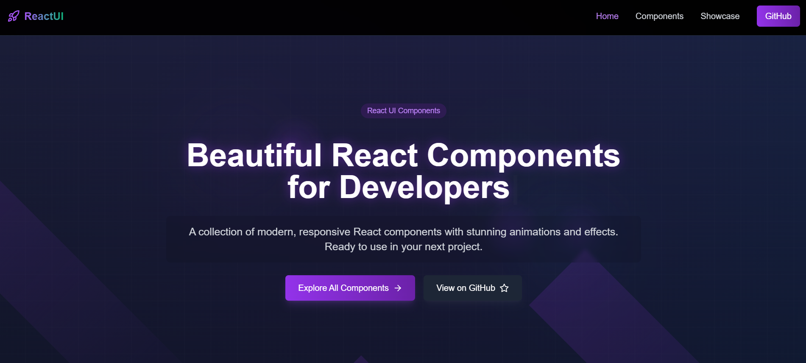

# ReactUI - Beautiful React Components



A collection of modern, responsive React components with stunning animations and effects. View the live demo at [react-ui-awesome.netlify.app](https://react-ui-awesome.netlify.app/)

## 🚀 Features

### Core Features
- 🎨 Modern & Beautiful Components
- 📱 Fully Responsive Design
- ♿ Accessible Components (WCAG 2.1 compliant)
- 🎭 Stunning Animations
- 🌈 Beautiful Gradients & Effects
- 🛠️ Easy to Customize
- 📦 Ready-to-use Components

### Component Library
- **Interactive Cards**
  - Glass Morphism Cards
  - Hover Effect Cards
  - Animated Border Cards
  - Gradient Cards

- **Text Effects**
  - Gradient Text Animations
  - Typewriter Effects
  - Text Reveal Animations
  - Glowing Text Effects

- **Backgrounds**
  - Particle Networks
  - Animated Gradients
  - Grid Patterns
  - Light Beam Effects
  - Glowing Orbs

- **Navigation Components**
  - Responsive Header
  - Animated Menu Items
  - Smooth Transitions
  - Mobile-friendly Navigation

- **Buttons & Controls**
  - Gradient Buttons
  - Hover Effects
  - Icon Integrations
  - Loading States

- **Layout Components**
  - Hero Sections
  - Feature Grids
  - Responsive Containers
  - Flex & Grid Layouts

### Technical Features
- 🔧 Built with TypeScript for type safety
- 📱 Mobile-first responsive design
- 🎯 Zero-dependency core components
- 🚀 Optimized for performance
- 📦 Tree-shakeable exports
- 🎨 Customizable with Tailwind CSS
- 🔄 Hot Module Replacement (HMR)
- 📝 Comprehensive documentation

### Developer Experience
- 🛠️ Easy integration with existing projects
- 📚 Well-documented components
- 🎯 TypeScript support for better DX
- 🔄 Fast refresh in development
- 📱 Responsive testing utilities
- 🎨 Customizable theming system
- 🔧 Simple configuration
- 📦 Modern build system with Vite

## 🛠️ Built With

- [React](https://reactjs.org/) - A JavaScript library for building user interfaces
- [TypeScript](https://www.typescriptlang.org/) - For type-safe code
- [Vite](https://vitejs.dev/) - Next Generation Frontend Tooling
- [Tailwind CSS](https://tailwindcss.com/) - A utility-first CSS framework
- [Framer Motion](https://www.framer.com/motion/) - For animations
- [React Router](https://reactrouter.com/) - For routing
- [Lucide React](https://lucide.dev/) - Beautiful & consistent icons
- [TypeWriter Effect](https://github.com/tameemsafi/typewriterjs) - For text animations

## 📦 Installation

1. Clone the repository:
```bash
git clone https://github.com/yourusername/ReactUI.git
cd ReactUI
```

2. Install dependencies:
```bash
npm install
```

3. Start the development server:
```bash
npm run dev
```

4. Build for production:
```bash
npm run build
```

## 🔧 Environment Setup

Make sure you have the following installed:
- Node.js (v18 or higher)
- npm (v8 or higher)

## 📁 Project Structure

```
ReactUI/
├── src/
│   ├── components/     # Reusable components
│   ├── pages/         # Page components
│   ├── styles/        # Global styles
│   └── App.tsx        # Root component
├── public/            # Static assets
└── package.json       # Project dependencies
```

## 🤝 Contributing

We welcome contributions to ReactUI! Here's how you can help:

1. Fork the repository
2. Create your feature branch:
```bash
git checkout -b feature/AmazingFeature
```

3. Commit your changes:
```bash
git commit -m 'Add some AmazingFeature'
```

4. Push to the branch:
```bash
git push origin feature/AmazingFeature
```

5. Open a Pull Request

### Guidelines for Pull Requests:
- Ensure your code follows the existing style
- Update documentation as needed
- Include a clear description of the changes
- Add appropriate tests if applicable

## 📄 License

This project is licensed under the MIT License - see the [LICENSE](LICENSE) file for details.

## 🙏 Acknowledgments

- Thanks to all contributors who have helped shape ReactUI
- Special thanks to the React and Tailwind CSS communities

## 📞 Contact

For any questions or suggestions, please open an issue or reach out to me on GitHub.

---
Made with ❤️ by the Zeej
